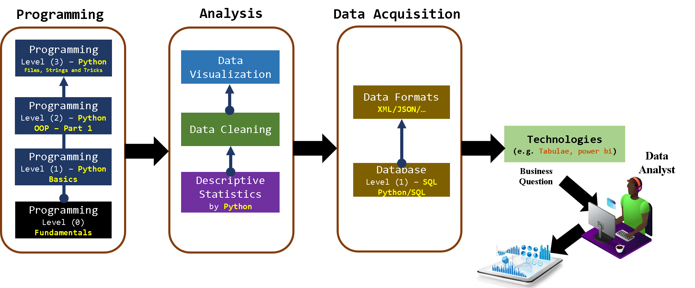

[Back](https://github.com/aorogat/Data-Science-and-Software-Engineering/blob/master/README.md)
# Data Analyst
Data analysis is the process of collecting, cleaning, transforming and visualizing the data to find out valuable insights and conclusions to support the decision-makers. The figure below shows the required skills to be a Data Analyst. Each rectangle in the figure has a corresponding course where all the courses are in Arabic.

## Programming series
#### 1- Programming Level (0) [\[Youtube Playlist\]](https://www.youtube.com/playlist?list=PL73bE5x5W-IDgkSxUQx9GCv0vBQPjBNuJ)
In this level, you will learn the fundamental of programming in general without writing specific programming language codes. 
The topics covered are 
`Problems and Computational Problems`, 
`Computer operations: Read-Processing-Write`, 
`Algorithms: Pseudo Code and Flowchart`, 
`Operators`, 
`Statements and Expressions`, 
`IF-For-While statemets`, 
`Function and Fuction-calling Statement`, 
`Programming Languages, Syntax, IDE and Compiler`.
After that course, you will have enough knowledge about what is meant by a programming language (e.g. concepts and tools[IDE]) and choose the suitable programming language for your needs.

#### 2- Python - Level (1), Basics [\[Youtube Playlist\]](https://www.youtube.com/watch?v=M1m9rtZYN-4&list=PL73bE5x5W-ICe8Wb9bFK85FFFGXbNtMx5)
In this level, you will apply all the concepts of Procedural Programming. 
These topics are 
`Writing and reading the data`, 
`If Statement`, 
`Swithh Statement`, 
`For-loop Statement`, 
`While-loop Statement`, 
`Arrays`, 
`Function and Fuction-calling Statement`. 
At the end of this level, there is a project about ATM which helps you to apply such concepts and think in the level of components (functions).

#### 3- Python - Level (2), OOP \[Part 1] [\[Youtube Playlist\]](https://www.youtube.com/watch?v=65LBTWC9OUo&list=PL73bE5x5W-ICjN2bL9On_dtReRSBRr8Fz)
This level only has the lessons of Object-Oriented Programming  (OOP) which is necessary for Data Analyst and Scientist. 
These concepts are 
`Classes and Objects`, 
`Encapsulation`, 
`Composition`, 
`Inheritance`. 
The remaining concepts of OOP are on another level. 

#### 4- Python - Level (3), Tricks [\[Youtube Playlist\]](https://www.youtube.com/watch?v=LdUOgE-73To&list=PL73bE5x5W-IAhtvykYAe9T3un76xkexVx)
In this level, I finalize the Python programming language by going through its documentation and teach all missed points and tricks.

## Analysis series
#### 1- Descriptive Statistics by Python [\[Youtube Playlist\]](https://www.youtube.com/watch?v=ZmSVoAyY1LM&list=PL73bE5x5W-ICemDprdzo0HibsFiUQIEM5)
This is the first version of Descriptive analysis courses that is enough for Junior Data analysts. Seniors Data analysts must learn more about exploratory data analysis, confirmatory data analysis, data mining and multivariate statistics. 
The topics covered are 
`Centeral Tendancy`, 
`Spread measures: SD, Range, Quartiles and Box Plot`, 
`Districution and Histogram`, 
`Skewness, Kurtosis and Outliers`, 
`Data: Uni-Bi-Multivariate`, 
`Data: Qualitative and Quantitative`, 
`Correlation`.
#### 2- Data Cleaning by Python [\[Youtube Playlist\]]()
Usually, the data you are working with having troubles as typos, missing values and outliers. One of your tasks is to be able to clean the data before analysis.
## Data Acquisition series
Data acquisition means reading the data from its source. Since Data analyst usually works on companies that have their data stored in a database, Data Analyst recruiters expect your ability to read such data from their database. 
#### 1- Database Level (1) – SQL - Python/SQL [\[Youtube Playlist\]]()
Databases courses usually have diverse topics for different skills such as you and Data Engineers. In this course, you will just learn the skills that help you to read the data you need to analyze from the database. 
#### 2- Data Formats XML/JSON/… [\[Youtube Playlist\]]()
Sometimes data are not stored in a relational database, however, is stored in files with specific formats like XML, JSON and so on. Data analysts are expected to be able to handle such files.
## Technologies series
One of the following courses is enough. These are the programs that help you in your work with less programming. I will not record these courses but will give you links to courses in English. 

#### 1- Tabulae [\[What is it?\]](https://youtu.be/YfE9jBq002s) [\[Edureka Channel \]](https://youtu.be/jj6-0cvcNEA)
#### 2- Power bi [\[What is it?\]](https://youtu.be/yKTSLffVGbk)[\[Learnit Training Channel\]](https://youtu.be/i3CSD7bMMbg)

# Libraries
During the above courses, you have to finish the following libraries. Although the lessons of such libraries are distributed across these courses, I also added them to separated playlists to be easy for you to return to them anytime.
#### Matplotlib [\[Youtube Playlist\]]()
#### Numpy [\[Youtube Playlist\]](https://www.youtube.com/playlist?list=PL73bE5x5W-IBnRfesDLHH9GpuPDfl1N-u)
#### Pandas [\[Youtube Playlist\]]()

# Prepare your CV
* In parallel to the technical skills illustrated here, you have to enhace your ability in English, Presentations, Storytelling, Time Management, Team Work, Report Preparation and CV writing. Good Luck!!
