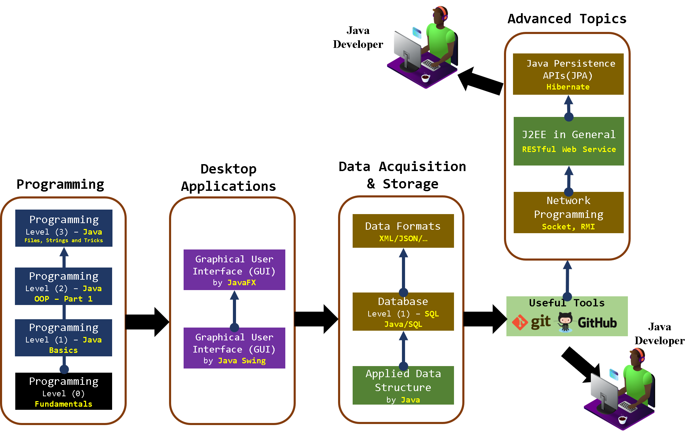

[Back](https://github.com/aorogat/Data-Science-and-Software-Engineering/blob/master/README.md)
# Java Developer
A Java Developer is responsible for the development of Java-based applications. Because Java is widely used, especially by large companies, everyday roles differ in a wide range of skills. Most of the roles share the skills illustrated below. Each rectangle in the figure has a corresponding course where all the courses are in Arabic.

Java Developer differs from Software Engineer. While a Java developer is directed entirely on application development that uses the Java language, a Software Engineer is working on all stages of software engineering like Requirements Analysis, Design, Development, Testing and Maintenance with multiple languages that may not be Java-based.

## Programming series
#### 1- Programming Level (0) [\[Youtube Playlist\]](https://www.youtube.com/playlist?list=PL73bE5x5W-IDgkSxUQx9GCv0vBQPjBNuJ)
In this level, you will learn the fundamental of programming in general without writing specific programming language codes. 
The topics covered are 
`Problems and Computational Problems`, 
`Computer operations: Read-Processing-Write`, 
`Algorithms: Pseudo Code and Flowchart`, 
`Operators`, 
`Statements and Expressions`, 
`IF-For-While statemets`, 
`Function and Fuction-calling Statement`, 
`Programming Languages, Syntax, IDE and Compiler`.
After that course, you will have enough knowledge about what is meant by a programming language (e.g. concepts and tools[IDE]) and choose the suitable programming language for your needs.

#### 2- Java - Level (1), Basics  [\[Youtube Playlist\]](https://www.youtube.com/playlist?list=PL73bE5x5W-IDK_ksDRHQRDW_7qvUAWgfy)
In this level, you will apply all the concepts of Procedural Programming. 
These topics are 
`Writing and reading the data`, 
`If Statement`, 
`Switch Statement`, 
`For-loop Statement`, 
`While-loop Statement`, 
`Arrays`, 
`Function and Fuction-calling Statement`, 
`Method Overloading`. 
At the end of this level, there is a project about ATM which helps you to apply such concepts and think in the level of components (functions).

#### 3- Java - Level (2), OOP [\[Youtube Playlist\]](https://www.youtube.com/playlist?list=PL73bE5x5W-IDXOPAssRtlfJzh_Dbl9wxL)
In this level, you will learn the concepts of Object-Oriented Programming (OOP) to be able to organize larger projects. These concepts are 
`Classes and Objects`, 
`Encapsulation`, 
`Composition`, 
`Inheritance`, 
`Casting`, 
`Polymorphism`, 
`Abstraction`, 
`Interfaces`. 
There is a project at the end in which you will apply all the concepts of OOP. 

#### 4- Java - Level (3), Tricks [\[Youtube Playlist\]]()
In this level, you will go through Java documentation. After that, you will learn the following 
`Try and Catch`, 
`Wrapping Classes`, 
`Strings, from encoding to manipulation.`, 
`Regular Expressions`, 
`Math Class, System class, Object class, and some other important classes.`, 
`Streams and Files`, 
`Generics`, 
`Java Virtual Machine (JVM) and Memory Management.`, 
`Multithreading and Synchronization`, 
`What is after JDK8`, 
`Some tricks`, 
`J2SE packages in general.`

#### 5- Network Programming (Socket, RMI,  HTTP)

## Desktop Applications series
#### 1- Java - GUI - Swing [\[Youtube Playlist\]](https://www.youtube.com/playlist?list=PL73bE5x5W-IA8t-LdfAli-7uM9ctsZzrJ)
The topics covered are 
`Swing Package`, 
`Components and Containers`, 
`Layout Managers`, 
`Event-Driven Programming`, 
`Listeners`, 
`Bird's Eye view`,  
`GUI Builder Tools`,
`Graphs`.
After this level, you will be able to develop any desktop applications. There are 2 projects at the end, one for GUI design and a simple 2D game to apply on the lessons of Graphs.

#### 2- Java - GUI - JavaFX [\[Youtube Playlist\]](https://www.youtube.com/playlist?list=PL73bE5x5W-IA8t-LdfAli-7uM9ctsZzrJ)
After this level, you will be able to develop desktop applications with more features. 

## Data Acquisition and structure
While Data acquisition means reading the data from its source, we mean by structure, how to organize such data in memory. Since Developers usually work on companies that have their data stored in databases, Developer recruiters expect your ability to read such data from their database. 
#### 1- Java - Applied Data Structure [\[Youtube Playlist\]](https://www.youtube.com/playlist?list=PL73bE5x5W-ICLzNwt5aAjnstOlqNgtqMJ)
In this level, you will learn the main data structures like `List`, `Tree`, `Graph`, `Map`, `Set`, `Hashtable`, and `others` and how to use them. This level does not include how these data structures built from Arrays and nodes as well as does not include the theoretical illustration of their corresponding operations. 
#### 2- Database Level (1) – SQL - Java/SQL [\[Youtube Playlist\]](https://www.youtube.com/playlist?list=PL73bE5x5W-IDErOUNGLYUXFcw2Tan_BAq)
Databases courses usually have diverse topics for different skills such as Data Analysts, Developers and Data Engineers. In this course, you will just learn the skills that help you to create a database and access the data you need from the database.
* Sample Database: [Chinook](https://www.sqlitetutorial.net/sqlite-sample-database/)
* Sample Database: [Northwind](https://github.com/aorogat/northwind-SQLite3)
#### 3- Data Formats XML/JSON/… [\[Youtube Playlist\]]()
Sometimes data are not stored in a relational database, however, is stored in files with specific formats like XML, JSON and so on. Developers are expected to be able to handle such files.

# Take a breath then continue 

## Useful Tools
#### 1- Git and Github

## Java build automation tools 
#### 1- Java without IDE
#### 2- Ant, Gradle and Maven differences 
#### 3- Maven in details 

## Software Engineering 
#### 1- Design Patterns 
Design patterns are typical solutions to commonly occurring problems in software design. They are like pre-made blueprints that you can customize to solve a recurring design problem in your code.
Although you don't need to design the system you are working on as the software engineer is in charge of that, you have to be able to understand the design to implement it. 
This [link](https://refactoring.guru/design-patterns/java) is useful.

## Framework based Applications 
#### 1- Framework based Applications Introduction
#### 2- J2EE frameworks in general and RESTful Web Service.
#### 3- Java Persistence APIs(JPA) and Hibernate
#### 4- Spring Framework (J2EE applications)
#### 5- Spring Boot Framework (RESTful Services)

# Prepare your CV
* In parallel to the technical skills illustrated here, you have to enhace your ability in English, Time Management, Team Work, Report Preparation and CV writing. Good Luck!!
